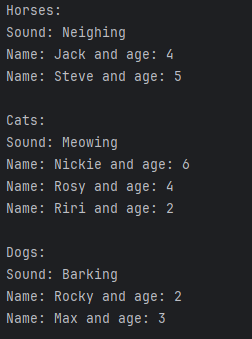

## Description
This Java program is demonstrating inheritance and abstraction with animal classes (Horse, Cat, Dog) inheriting from an abstract Animal class. The Animal class serves as an abstract base class defining common attributes and an abstract method for producing the sound of an animal, which will be implemented in the subclasses.
## Example

